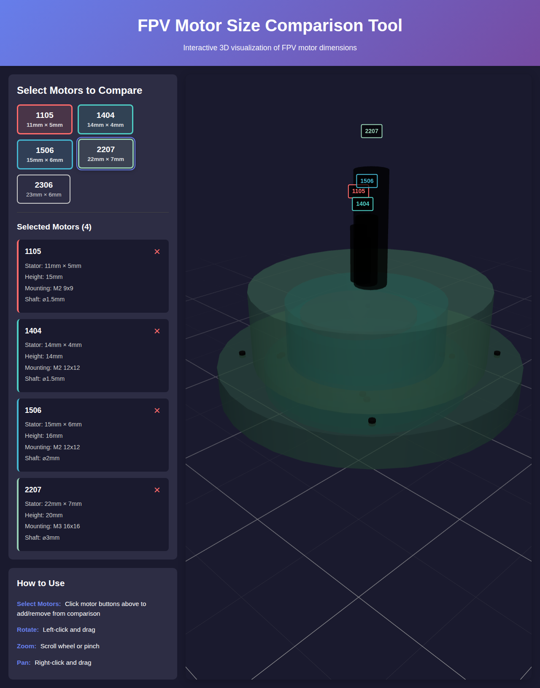

# FPV Motor Size Comparison Tool

Interactive 3D visualization tool for comparing FPV motor sizes. Built with React, Three.js, and React Three Fiber.

**[Try it live on GitHub Pages](https://matthewww.github.io/fpv-motor-size-compare/)**



## Features

- ✅ Interactive 3D visualization of FPV motors
- ✅ Accurate proportional dimensions based on real motor specs
- ✅ Compare multiple motors simultaneously (overlay mode with transparency)
- ✅ 5 pre-configured motor sizes: 1105, 1404, 1506, 2207, 2306
- ✅ Full camera controls (rotate, zoom, pan)
- ✅ Motor specifications display
- ✅ Responsive design

## Motor Specifications

The tool includes the following motors with accurate dimensions:

| Motor | Stator Size | Height | Mounting Pattern | Shaft Diameter |
|-------|------------|--------|------------------|----------------|
| 1105  | 11mm × 5mm | 15mm   | M2 9x9          | 1.5mm         |
| 1404  | 14mm × 4mm | 14mm   | M2 12x12        | 1.5mm         |
| 1506  | 15mm × 6mm | 16mm   | M2 12x12        | 2mm           |
| 2207  | 22mm × 7mm | 20mm   | M3 16x16        | 3mm           |
| 2306  | 23mm × 6mm | 19mm   | M3 16x16        | 3mm           |

## Installation

```bash
# Clone the repository
git clone https://github.com/matthewww/fpv-motor-size-compare.git

# Navigate to the project directory
cd fpv-motor-size-compare

# Install dependencies
npm install
```

## Usage

### Development Mode

```bash
npm run dev
```

This will start the development server at `http://localhost:5173`

### Build for Production

```bash
npm run build
```

This will create an optimized production build in the `dist` folder.

### Preview Production Build

```bash
npm run preview
```

## How to Use the Application

1. **Select Motors**: Click on motor buttons to add or remove them from the comparison
2. **View in 3D**: Selected motors appear in the 3D viewport with color-coded labels
3. **Interact with the Scene**:
   - **Rotate**: Left-click and drag
   - **Zoom**: Scroll wheel or pinch gesture
   - **Pan**: Right-click and drag
4. **View Specifications**: Selected motor specs are displayed in the side panel

## Technology Stack

- **React 19**: UI framework
- **Three.js**: 3D graphics library
- **React Three Fiber**: React renderer for Three.js
- **@react-three/drei**: Useful helpers for React Three Fiber
- **Vite**: Build tool and development server

## Adding New Motors

To add a new motor to the comparison tool, edit `src/data/motorData.js`:

```javascript
export const motorSpecs = {
  // ... existing motors
  "2508": {
    name: "2508",
    statorWidth: 25,
    statorHeight: 8,
    shaftDiameter: 4,
    mountingPattern: "M3 16x16",
    baseHeight: 3.5,
    totalHeight: 22,
    color: "#FF9800" // Choose a unique color
  }
};
```
